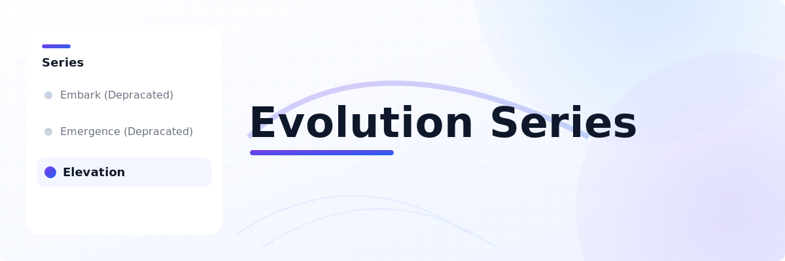

<div align="center">
  
  <br>
  <h1>Evolution Series: Research on State of the Art Open Language Models</h1>
  <h2>2025 Update - Introducing Elevation, the new flagship model<h2>
</div>


Project Overview

Elevation is the third generation in the Evolution series of advanced open-source language models, following the pioneering work of Embark and Emergence (both now deprecated). This project represents a new milestone in the design, training, and evaluation of state-of-the-art large language models (LLMs), d to advance the science and engineering of artificial intelligence.

## Research Motivation

The Evolution series is driven by a commitment to open research, reproducibility, and technical innovation in AI. Elevation explores novel architectures, data curation strategies, and optimization techniques, aiming to:

- Set new benchmarks for open LLM performance
- Enable transparent, reproducible model development
- Foster community-driven progress in AI research

## Methodology

Elevation employs a multi-stage training pipeline:

- **Stage 1:** Large-scale pretraining on diverse, high-volume datasets to capture broad linguistic and factual knowledge
- **Stage 2:** Targeted fine-tuning on curated, high-quality corpora to enhance model specialization and robustness
- **Model Averaging:** Ensemble and weight-averaging techniques to maximize generalization and stability

All training configurations, checkpoints, and data provenance are documented and released for scientific review.

## Training and Model Creation

To train and build Elevation from source:

1. Install [PyTorch](https://pytorch.org) and required dependencies for your system.
2. Clone the Evolution repository:
   ```bash
   git clone https://github.com/YOUR_ORG/Evolution.git
   cd Evolution
   pip install -e .[all]
   ```
3. Prepare your training data according to the provided configuration templates.
4. Launch training using the provided scripts and configuration files:
   ```bash
   torchrun --nproc_per_node=8 scripts/train.py configs/elevation-stage1.yaml
   # For fine-tuning:
   torchrun --nproc_per_node=8 scripts/train.py configs/elevation-stage2.yaml
   ```
5. All checkpoints and model artifacts will be saved locally for further analysis and deployment.

## Citation

If you use Elevation or the Evolution series in your research, please cite this project:

```bibtex
@misc{evolution2024elevation,
      title={Elevation: The Evolution Series State-of-the-Art Language Model},
      author={Your Name and Contributors},
      year={2024},
      url={https://github.com/YOUR_ORG/Evolution},
}
```

## Acknowledgements

Elevation builds on the experience and lessons learned from Embark and Emergence, and is made possible by the support of the open-source AI research community.
